This Blog is a project divided into 3 sub-projects: **Research**, where we empathize with the user, and make ideas to better the user's UX experience, **Prototype**, where we make a Figma prototype that illustrates our final idea, and **Usability Study**, where we present our project to 5 people, and let them test what we did, and gather their feedback.

## Chosen Persona
### Regina's Persona
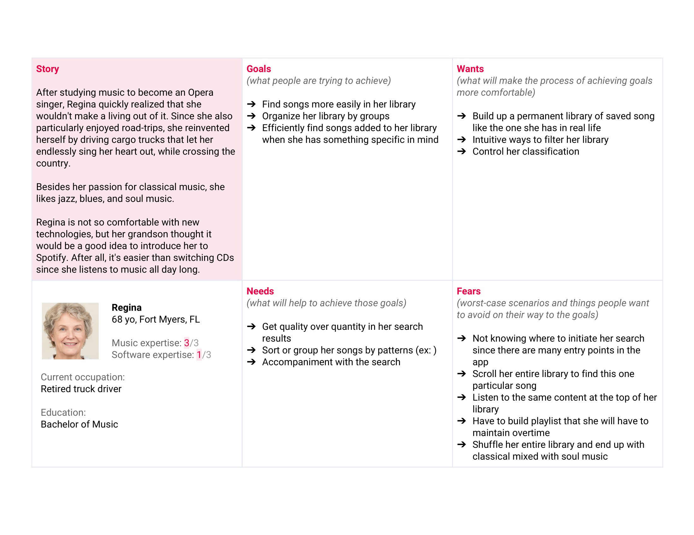

Regina studied to be an Opera Singer. After that, she realized that she wouldn't make a living out of it. Since she liked road-trips, she reinvented herself by driving cargo trucks cross country, while listening to music and endlessly singing her heart out.

Regina is not so comfortable with new technologies, but her grandson introduced her to Spotify, since he thought it would be a better idea that her switching CD's all day long.

#### Her UX goals
(What she's trying to achieve)
- finding songs more easily in her library
- organize her library by groups
- efficiently find songs added to her library when she has something specific in mind

#### Her UX needs
(What will help achieve her goals)
- Get quality over quantity in her search
- Sort or group her songs by patterns
- Accompainment with the search

#### Her UX wants
(What will make achieveing her UX goals easier)
- Build up a permanent library of saved songs like the one she has in real life
- Intuitive ways to filter her library
- Control her classification

#### Her UX fears
(Regina's worst-case UX scenarios)
- Not knowing where to initiate her search
since there are many entry points in the
app
- Scroll her entire library to find this one
particular song
- Listen to the same content at the top of her
library
- Have to build playlist that she will have to
maintain overtime
- Shuffle her entire library and end up with
classical mixed with soul music

### Regina's User Journey Map
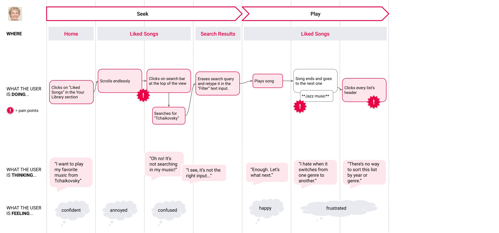

Regina wanted to find her favorite music, so she first went into her ``Liked Songs`` in the ``Your Library`` section and scrolled endlessly, making her feel annoyed.

Then, seached for it in the top searchbar, but then she relized that that searchbar isn't searching in __her__ music. So, she re-typed it in the correct one, and played it.

After that music finished playing, another song of a completely different genre started playing. Regina hates it when the genres switch.

## Why did I choose Regina?

I chose Regina because she didn't seem too comfortable with new technologies, and I simpathize with her for that. I also chose her because she seemed very different from me, and that could help me both simpathize and be an un-biased UX designer at the same time. I also chose her because of her age, since I'd love to design easier and more intuitive GUI's for her, my grandparents, and for people like me, who don't know what we're doing all of the time, and can't pick up the skills for using a GUI right away.

## Opportunities for Improving the UI
The biggest opportunities for improvement that I saw, after doing the sketches and protypes, are:
- to make the purpose of the widgets in the app be more clear
- to make adding new songs easier, as little operations as possible
- to make finding a song in ``Your Library`` easier
- making the size of widgets bigger 

## Note
This is my first UX project, and the point of this blog post is for me to learn, so if you have any constructive feedback, I'd love to hear it!

Also, I want to appologize, because I've never used Spotify, and at first, I almost didn't use the interface. Most of the ideas I made, I made before I even searched for a song online. I ended up refining some things later, for the final 3-1 idea, but I rushed through the big majority of the project, and therefore there's probably still lots I don't know. I also had a lot better ideas after, that I didn't include.

So, let me know all of the inaccuracies I made in this project, your feedback on my ideas, and what I could improve. God bless you.

## Ideas
- Sort the songs automatically?
    No, because Regina may want to sort by date, genre, year, etc.

### My first approach would be to have an option for everything

"Your Library" would have a search bar for everything, each folder would have a search bar for each playlist, each playlist would have a search bar for each song.

The same would be true for playing them, and sorting-by.

Each set of options would popup when collapsing a folder, playlist, song, etc..., And would let you search for and play anything below its hierarchy.

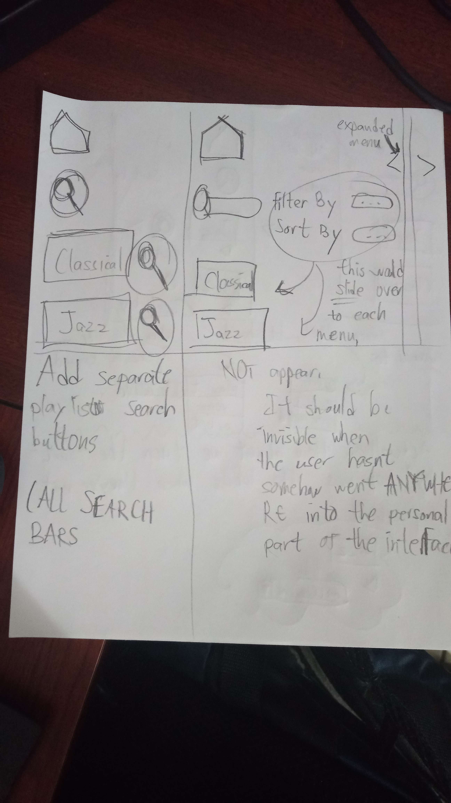

### Just make the searchbars be able to yield results for ANYTHING in its category.
After trully inspecting the Spotify GUI, I realized that you already can find particular songs inside of a separate search bar for a playlist, **But you can't find a song through the main "Your Library" searchbar.**

I think that having the "Your Library" searchbar look for EVERYTHING in "Your Library" is better, **when you don't know where to look for things.** For example: searching in a folder should yield results for all of the playlists there, and all the songs there, in any of those playlists, as well.

Then, I'd have every sub-searchbar that may appear in the app do the same, for maximum coverage.

The search results should CLEARLY AND BOLDLY be labeled as a playlist, folder, genre, album, etc...

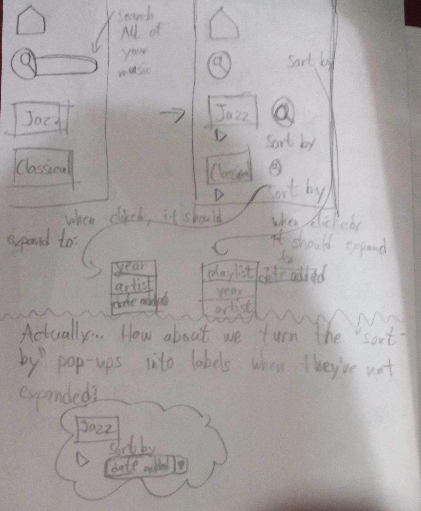

(I had refused to trully use Spotify yet, so I didn't know that the playlists would become big in the main panel, and their own searchbars would be there, but I discovered that the searchbar in ``Your Library`` was **still incapable of searching for ANY SONG, and not just playlists**)

### Organizing Regina's Library
To **organize her library by groups** and have those groups be **patterns**:

I'd simply have a feature that creates a new folders to organize her already existing songs (like a "soft link" folder to existing songs in her library). You could have different folders dedicated to different ways of orginazing them, too. And to go above and beyond, have the option to manually make some changes before "saving" them, or sticking to the current ones. It should also allow Regina to manually edit the mistakes the algorhtims may make.

Or simply add a ``sort by genre`` option when playing songs. However, this doesn't let Regina have a permanent, organized library, like she wanted.

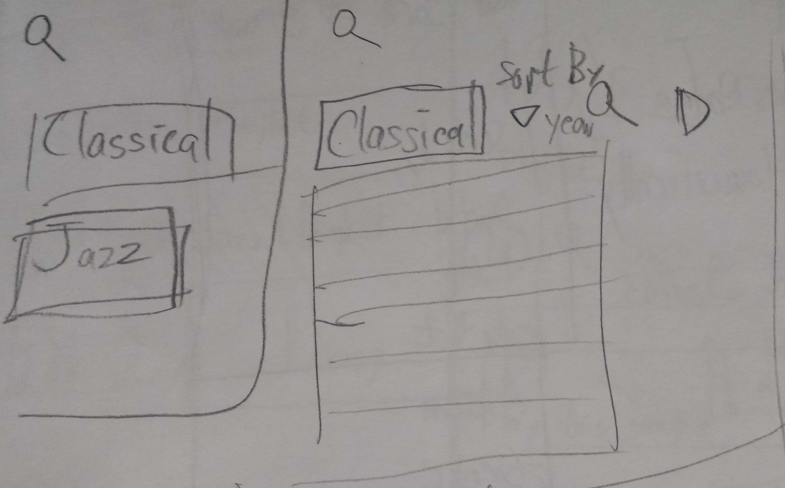

Automatically generate and organize folders with different genres, dates, etc... **This should only be a search result, and not stored permanently**

Adding an option to create a new group (or playlist or folder). Then adding an option to save music from online into ``Your Library``, and having the app make Regina choose where. (I think adding a new playlist or new folder in ``Your Library`` could do the same)

(By this time, I had used the interface a bit more)

### Position and label search widgets to make their purpose clear
I'd move the ``Home Search`` div to be above the whole screen and make it bigger. Also, make the left side panel a bit bigger by default.

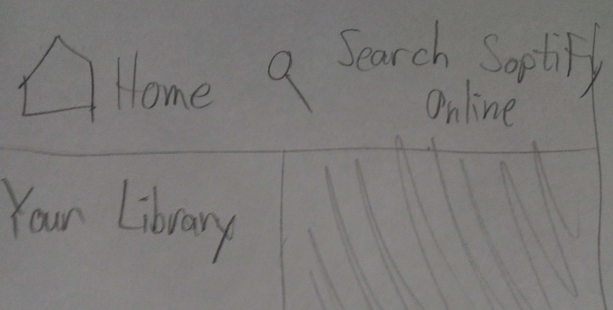

I'd then turn the little search button inside the ``Your Library`` into a visible searchbar, make it a bit bigger, and display a ``Search in Your Library`` placeholder, to make it more clear which search query goes where.

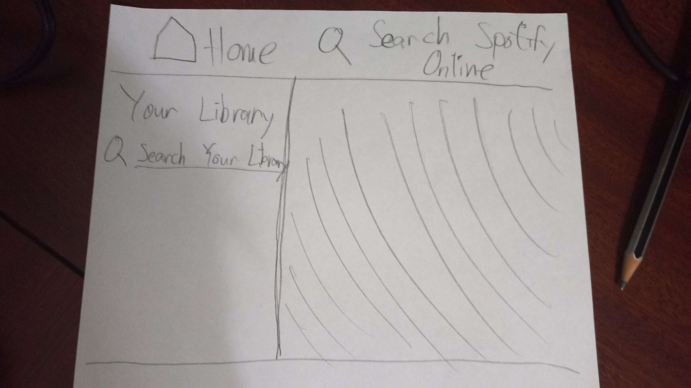

I'd add placeholders / labels for ALL the search bars, or make them go in clearly seperated sections that are somewhat clearly separated, or are farther appart from eachother.

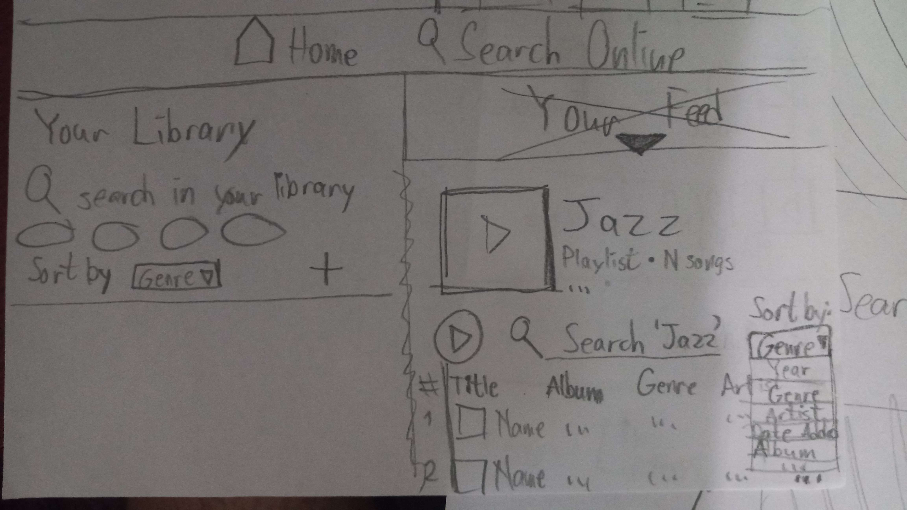

Change the color of the divs to match their purpose: the header and public Spotify search results should have the same background color A, and the ``Your Library`` ``div`` and private search results should have matcing background color B.

Make the playlist and song search results "come out" from ``Your Library`` when the results are in ``Your Library``, and search results "come out" from the top navbar when they are public search results

### Add folders, playlists and songs to Your Library directly from the song's interface
There should be a ``+`` button to add a song being played from public results, that can search through places in ``Your Library`` to place the song in.

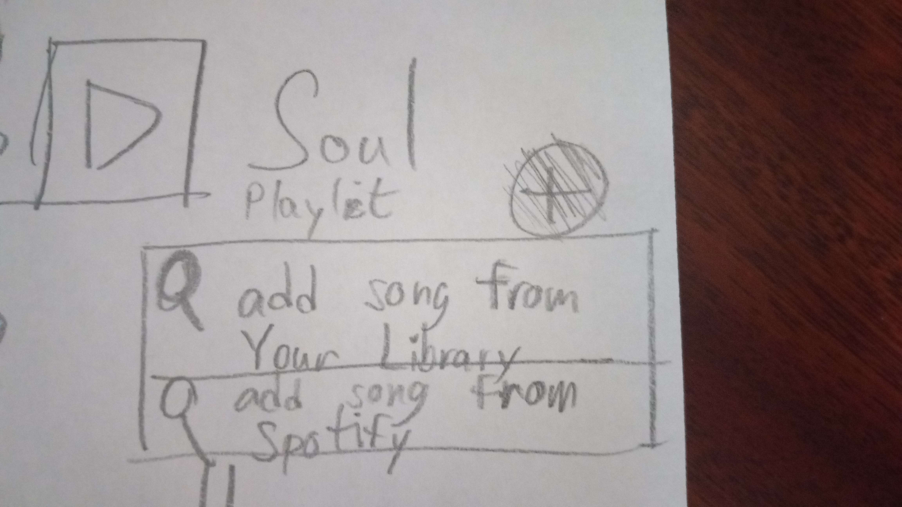

## Final 3-in-1 Solution

After reviewing my work a bit more, and tweaking and considering my final solution, I've decided:

### Specify more what each widget does
- move the ``Home Search Online`` panel to be a header, **to make it easier for Regina to know that that searchbar is public, and not private**
- Make all of the searchbars have intuitive placeholders that say where each searchbar is searching, **to give Regina more of a clue to where she's searching**
- Make the library searchbar bigger and always visible, so that the placeholder can show up, **and show its purpose, that way Regina doesn't get confused where the input is going**
- Add ``Your Feed``, or something similar, at the top of the feed, **to indicate its purpose**

### Add more ways to find and organize search results, in search results or Playlists
- Make all of the searchbars search for ANYTHING where they're searching (folder, playlist, song, and maybe more), **So that Regina can find what she's looking for**
- Add ``Sort by`` option to **play AND search for** music in a playlist
- Add ``Genre`` and ``Year`` as ``Sort by`` options, since **Regina felt frustrated about that in her user chart**.

### Add 2 more options to add songs to Your Library
- Un-hide the ``Add to Your Library...`` and ``Add to playlist..`` popups on public playlist and song results, **to make it easier for her to add it**. Having the ``...`` buttons only show up when the mouse is hovering the song makes it much harder to know how to add the song to ``Your Library``.

- Add two ways to add a song in a library: search for songs online, or use songs already in ``Your Library`` (The songs would be added as a "link" to a song. This would allow results to not repeat when being searched, while still maintaining copies of songs in multiple playlists/folders when necessary)

### Mockups
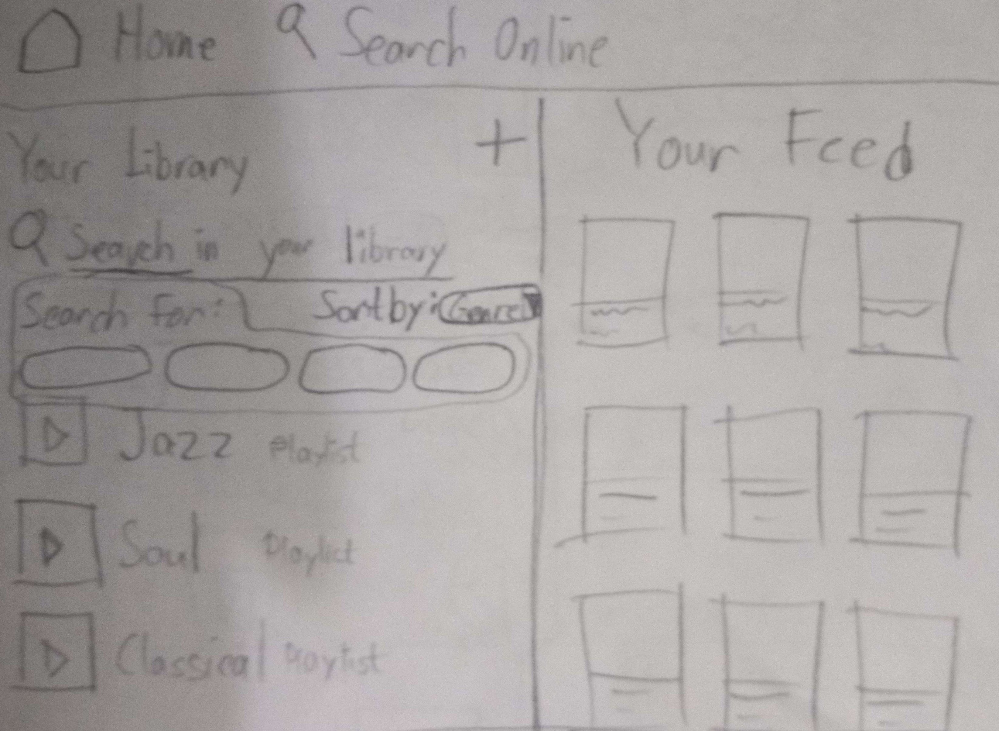
How the initial state of the app is when you first open it
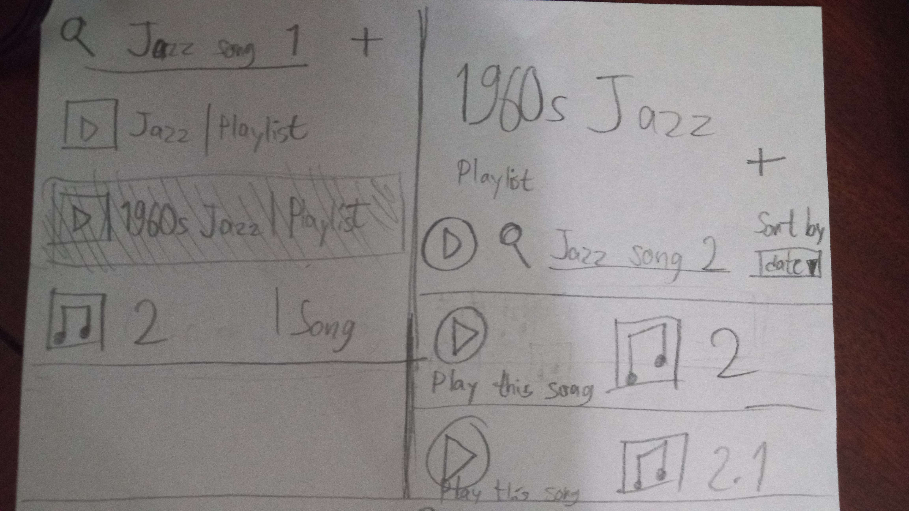
How the app should function when the user types something in the ``Your Library`` searchbar, coming from the previous mockup.

At the left, the search results in ``Your Library`` display anything inside of ``Your Library`` with that same name, same for the playlist at the right (This was meant to be a __zoomed in__ mockup of the app, don't panick)

**The playlist pops out of the ``Your Library`` panel, and should __seem__ connected to it**
<ing src="chosen_idea_0.jpg">
``Sort by`` ``Genre`` and ``Year`` an option in both search results in ``Your Library`` and in playlist.

(The sorting method should affect both the playlist and the playist's search results. IT SHOULD NOT BE PERMANENTLY CHANGING THE ORDER THAT THEY'RE STORED IN)

I'm not sure if sorting by Genre is always possible, but I think it could work if it were a new data piece that all songs could carry. The purpose of this project was to give the customer a better experience in theory, regardless of how feasable the changes are.

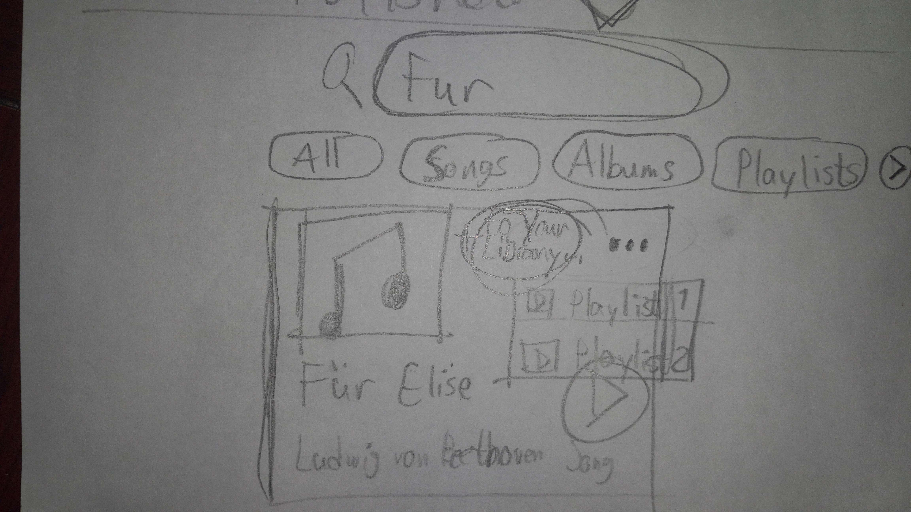
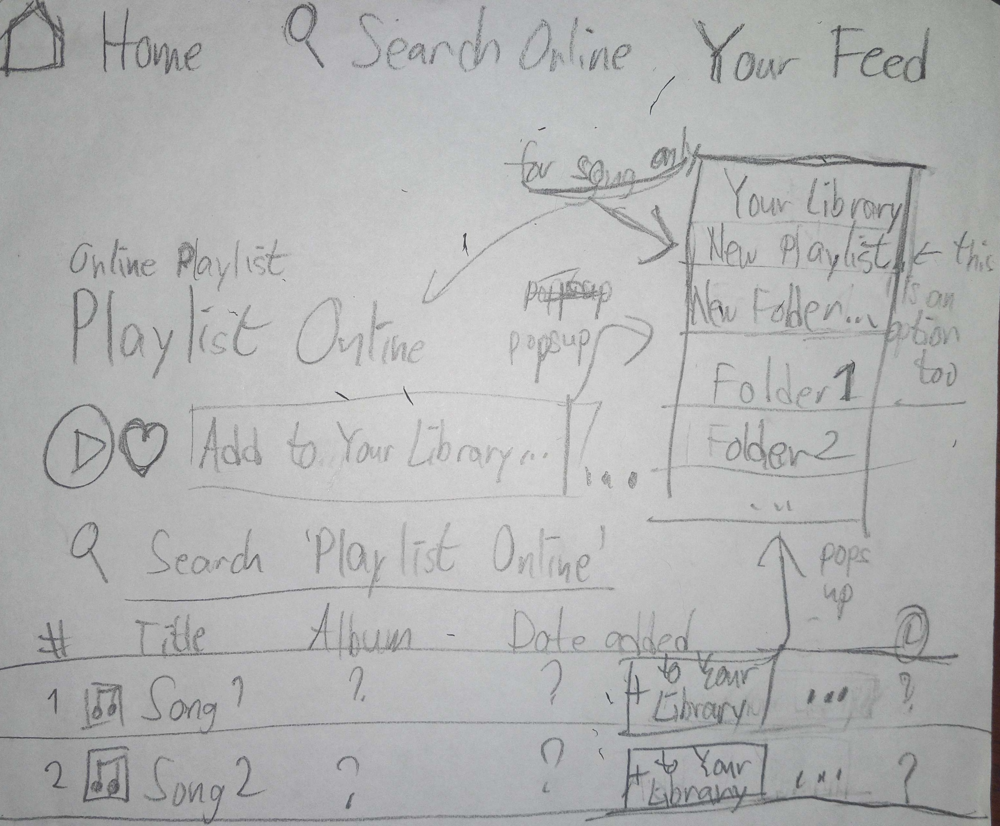
(The first image is the top result of a song online, and the second is a playlist online)

Anything that could be added to ``Your Library`` found online should have a VISIBLE button called ``Add to Your Library...``, that spawns a pop-up or extends a menu that gives Regina the option to save it somewhere. The buttons Spotify have are hidden inside a ``...`` popup button, which only shows up when the mouse hovers the song, but that's very unclear.

## Why did I choose these ones?
I thought they would give more control, express purpose clearly, and allow Regina to find and add songs to her library in less steps.

Some other solutions I made had less control or were a bit overwhelming. Although this final solution is also a bit overwhelming.

The idea for automatically sorting her library was too easy for the algorithms to mess up. And sorting the songs automatically without any option how would be beyond frustrating.

## Regina's Feedback
"I'm glad that there's now an option to add music from Online directly to My Library! I also appreciate that the searchbars have been labeled.But I still think there are too many things on screen!"

## Figma Prototypes
Here's the [prototype](https://www.figma.com/file/qAa7DvyAHcFIZXxjQvdMpx/Spotify-(Copy)?type=design&node-id=615%3A141&mode=design&t=deZIyV7Zcdr3WKVv-1).

## Usability Study
In this last part, I must get 5 or more people to use my Figma prototype, and see their reactions to know if my prototype was successful.

### Jesus - C21
He knew where to click to add a song to ``Your Library``, but the buttons didn't lead anywhere, and he acted confused after.

He also knew where to click to sort/search for in ``Your Library``.

He didn't know how could click to expand the playlists until I showed him. Then he said "Oh, man!", indicating that he couldn't have known that was an option.

The public playlist and public song results pages weren't connected at all to the first one, so he couldn't see how to add a song from the public areas.

He also tried to play the song, but the button doesn't actually play anything.

### 's Result
At the end, he knew how to add to ``Your Library`` from ``Your Library``, user to ``Sort by`` button and experimented with the ``Search for`` buttons, but was surprised that they didn't do anything. He didn't know to expand the playlist items, and was surprised that he couldn't play the song.

###
###
###
###

## Conclusion
